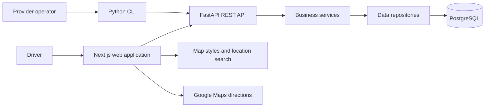

# EMPower

**Find a charging station. Choose your connector. Reserve your spot.**

An EV charging management platform with an interactive map, connector-level reservations, and provider tools.

**Next.js · React · TypeScript · FastAPI · PostgreSQL · Docker**

[Explore the Features](#features) · [Architecture](#architecture)

---

## About the project

**EMPower** is a web application for discovering and reserving electric vehicle charging points within a single provider's network. It brings location, availability, connector compatibility, charging power, and pricing into one interface, helping drivers choose where to charge before they arrive.

The application combines a responsive map interface for drivers with a REST API and a command-line interface for provider operations. Its backend manages charging infrastructure, reservations, charging-session records, and status history in a PostgreSQL database.

Developed for the **Software Engineering course at the National Technical University of Athens (NTUA), 2025–2026**, EMPower demonstrates a complete application stack, from interface design and business rules to persistent storage, API documentation, and containerized deployment.

> **Note:** This repository is a public presentation of the EMPower academic project. The implementation is intentionally not included.

## Features

### Explore charging stations on a map

- **Interactive map:** Browse stations through MapLibre GL, with markers and a corresponding station list for the visible map area.
- **Location search:** Search for places and addresses in Greece, with autocomplete suggestions powered by OpenStreetMap's Nominatim service.
- **Current location:** Center the map on the driver's position using browser geolocation, when permission is granted.
- **Availability at a glance:** Distinguish between available, in-use, and offline stations through status labels and colors.
- **Directions:** Open Google Maps directions to a selected station.

### Find a compatible connector

- Filter by **Type 2, CCS, or CHAdeMO** connector type.
- Show **available connectors** or **fast chargers**, using a 50 kW threshold for the fast-charger filter.
- Sort stations by **price**, **availability**, or **proximity to the map center**.
- Open station details to inspect the address and individual connectors, including each connector's status, maximum power in **kW**, and price in **€/kWh**.
- Select a specific connector before making a reservation or using the charging action.

### Reserve and manage a charging spot

The reservation flow connects a selected connector to a user identified by email:

1. **Select an available connector** from a station's details.
2. **Enter an email address** if one has not already been saved in the browser.
3. **Review the reservation** with the station, connector, power, and price information.
4. **Confirm a 30-minute reservation.**
5. **View the active reservation**, including remaining time and its expiration time.
6. **Cancel the reservation** or use **Charge now** when ready.

The backend checks connector availability and whether the user already has an active reservation. It also handles expired reservations and releases connectors through reservation operations. The interface displays a countdown, confirmation dialogs, loading indicators, and success or error notifications throughout the flow.

### Use the app on desktop or mobile

On desktop, the map and station sidebar support browsing and comparing stations together. On mobile, users can switch between map and list views and open station details in a layout adapted to the smaller screen.

The interface supports **light, dark, and system themes**, including matching map styles. The browser remembers the email and user ID used for reservations so the application can retrieve an active reservation on a later visit.

### Manage the provider's network

The REST API and Python CLI expose operational capabilities beyond the driver-facing interface:

| Capability | What it supports |
| --- | --- |
| Charging-point lookup | List points and retrieve details for an individual point. |
| Status and pricing updates | Update a connector's operational status and price per kWh. |
| Reservations | Reserve a point with a default or specified duration through the provider API. |
| Charging-session records | Record session data and query sessions within a date range. |
| Status history | Retrieve a point's status changes over a date range. |
| Data administration | Import charging points from CSV and reset point data. |
| Health checks | Inspect API and database connectivity. |
| Data exchange | Use JSON or CSV output on supported endpoints and commands. |

## Implementation scope

EMPower is an academic application with implemented discovery, reservation, and provider-management workflows. In the web interface, **Charge** changes the selected connector's backend status to `charging`; **Charge now** first cancels the active reservation and then updates that status. Charging-session records are handled separately through the API and CLI.

The demonstrated charging action represents a software status transition. Physical charger control and payment processing are outside the current implementation. Email entry provides a lightweight reservation identity; it does not implement password-based login or email verification.

## Architecture

The backend separates HTTP handling, business rules, and database access:

- **API routes and schemas** define endpoints, validate requests, and structure responses.
- **Services** implement rules for availability, reservations, session records, and administrative operations.
- **Repositories** execute database queries and manage persistence through SQLAlchemy.

The frontend consumes dedicated `/api/ui` endpoints for map results, station details, user identification, and reservation management. Provider endpoints support point administration, session records, and status history, with the CLI acting as another API client.

Docker Compose runs the **frontend**, **API**, and **database** as three services. The CLI is installed in the API container, and a named Docker volume persists database data.

### Data model

Charging infrastructure is organized as **sites → EVSEs → connectors**. A site represents a location, an EVSE represents charging equipment at that location, and a connector holds the compatibility, power, price, and status information used by the application.

| Entity | Purpose |
| --- | --- |
| `sites` | Station names, addresses, and geographic coordinates. |
| `evses` | Charging equipment associated with each site. |
| `connectors` | Connector types, operational states, charging power, and pricing. |
| `users` | Email-based user records. |
| `reservations` | Connector reservations with start, expiration, and end timestamps. |
| `charging_sessions` | Session timing, battery state of charge, energy use, and cost fields. |
| `status_changelog` | Historical connector status transitions. |

### Engineering details

- **Geographic queries:** Map requests include visible-area bounds and applied filters so the backend can return relevant stations.
- **Connector-level operations:** Reservations target a specific connector while the browsing interface summarizes stations.
- **Transactional reservation updates:** The reservation repository uses row locks, with service-level commit and rollback handling for related updates.
- **Time handling:** Reservation responses include UTC timestamps and remaining seconds; the interface displays the expiration time in the Europe/Athens timezone.
- **Request handling:** The frontend shares an API client for JSON requests and error handling, with cancellation support for map requests.
- **Documented interfaces:** FastAPI provides interactive documentation, complemented by exported OpenAPI definitions and a Postman collection.

## Technology stack

| Layer | Technologies |
| --- | --- |
| Web application | Next.js 16, React 19, TypeScript |
| Styling and components | Tailwind CSS 4, Radix UI / shadcn, Lucide icons |
| Maps and location | MapLibre GL, CARTO map styles, OpenStreetMap Nominatim, browser geolocation |
| Themes and notifications | next-themes, Sonner |
| REST API | Python, FastAPI, Pydantic, Uvicorn |
| Database access | SQLAlchemy, psycopg2 |
| Database | PostgreSQL 17 |
| Provider CLI | Python, Typer, Requests |
| Deployment | Docker, Docker Compose |
| Testing | pytest, API and CLI integration tests |

## Academic context

**Team:** softeng25-20

**Course:** Software Engineering, 2025–2026

**Institution:** School of Electrical and Computer Engineering, National Technical University of Athens

EMPower brings together requirements analysis, data modeling, backend services, a responsive web interface, API and CLI development, testing, and deployment in one software engineering project.
